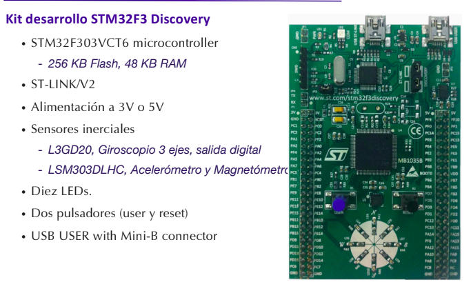
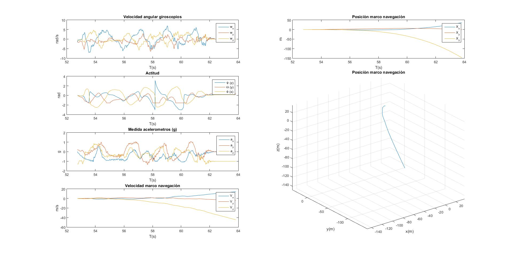
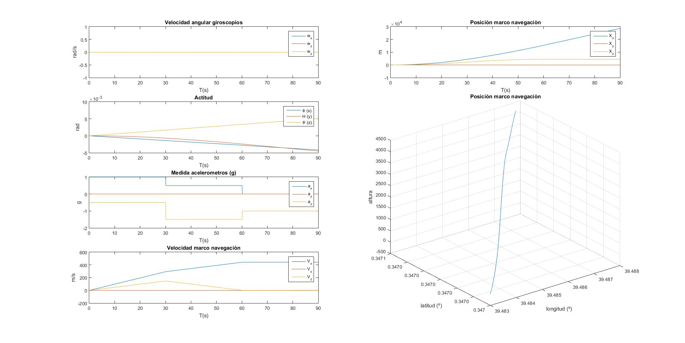

# Inertial Measurement Unit on STM 32 F3 discovery
The main idea for this project was to use Keil MDK-ARM-Basic IDE to communicate with interface of STM32 Discovery to collect data from its integrated Inertial Measurement Unit (Magnetometer, Accelerometer and Giroscopes), work with the I/O to signal the changes of orientation by LEDs and later pass the data to a Klaman Filter implemented in Matlab to work on it with direct-cosine-matrix/quaternions and visualise it.

The board is an ARM STM32F4 equipped with:
* 3D gyroscopes
* accelerometer
* magnetometer
* led circle
* pushbutton
* USB OTG/device on-board USB debugger

The project was split into 2 parts:
### IMU control
Contained in IMU_c code to work with the STM board, include some simple operations like light a LED oriented towards north or the one that is in the lowest point.
middlewares and mdk-arm given by Keil uVision and gcc/makefiles. 
oard - stm32f3discovery board specific files and utilities - serial port init - leds control - button control
imulib - library of imu related functions - Madgwick filter fusion algs (adapted/optimized) - on-board IMU devices read/initialize in correct aerospace order (optimized) - set of IMU/AHRS helper functions
CMSIS - ARM CORTEX M3 support definitions
STM32F30x_StdPeriph_Driver - CPU support package for STM32F3
STM32_USB-FS-Device_Driver - CPU support package for USB endpoint

Using the com.m file the data was transferred to a local server via USB and saved as .mat files for further processing and visualisations in Matlab.

### Kalman Filter and Matlab files
kalman_matlab contains various .m files:
utils -  algs with quaternion output and set of conversion functions into yaw/pitch/roll, euler etc.
trazas_IMU - apart from some saved movements contain also examples given by Universitat Politecnica de Valencia
testos contain analysis of data from trazas_IMU and visualisation code, some examples:
##### Movement 1
  
##### Movement 2 - turn left!
  
##### Movement 3 - going up!
  
Note:
This works contains parts of ARM's CSIMS and STMicro support libraries and other related works by multiple authors.
